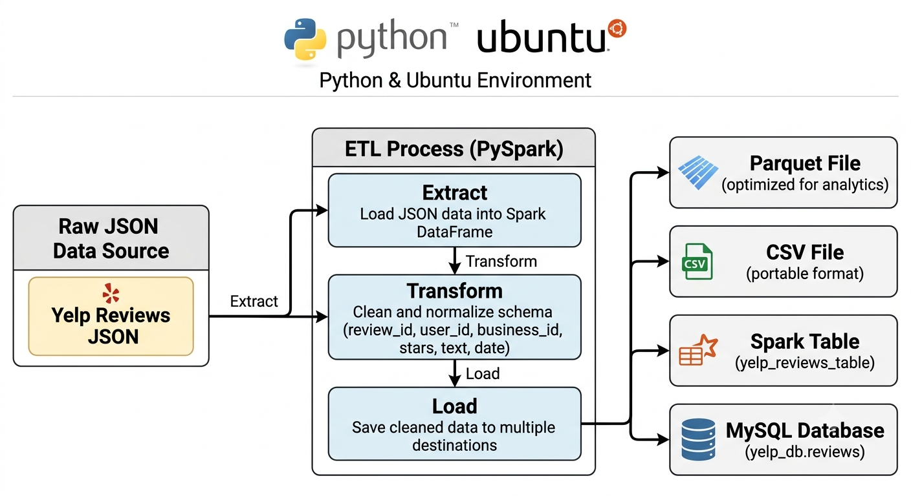
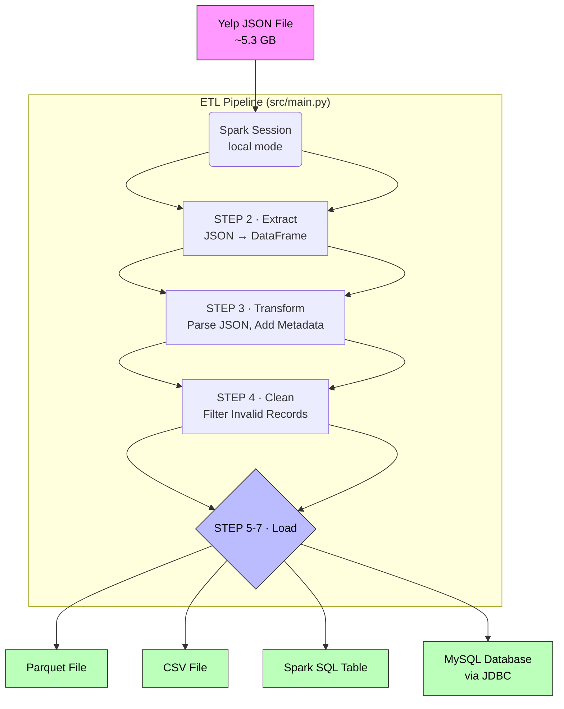
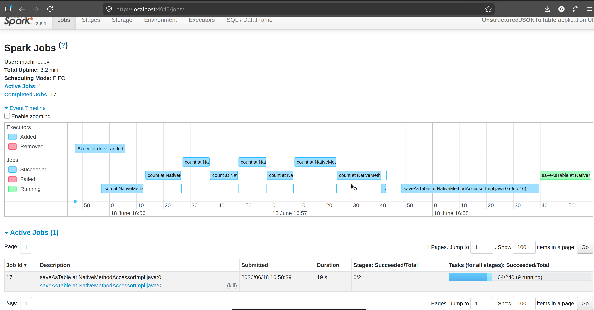
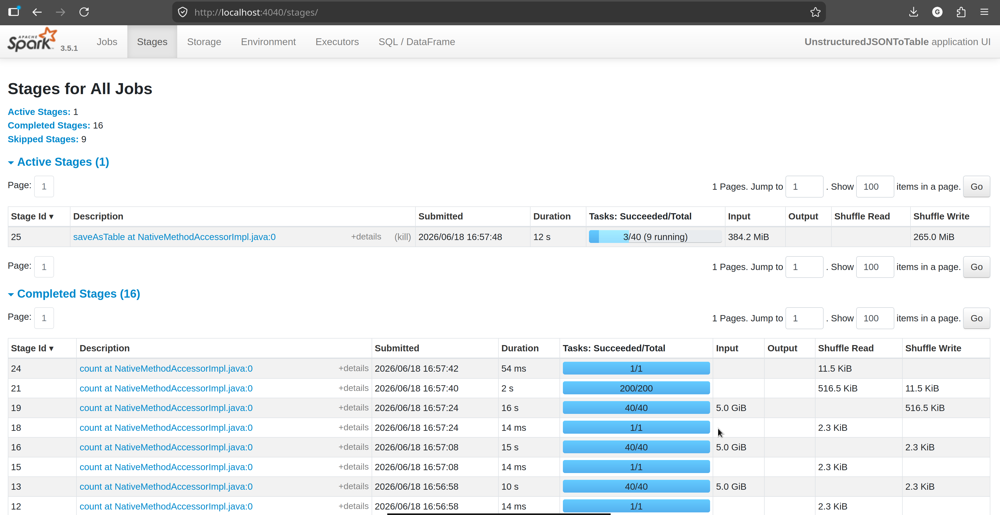
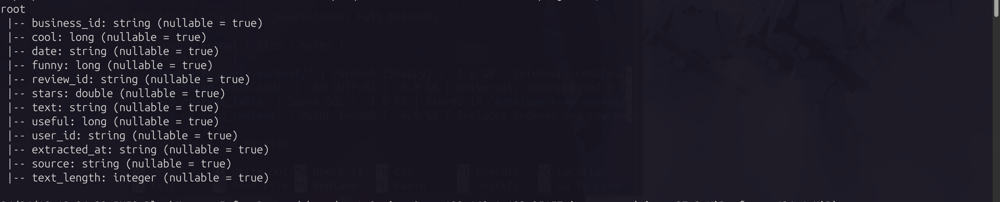
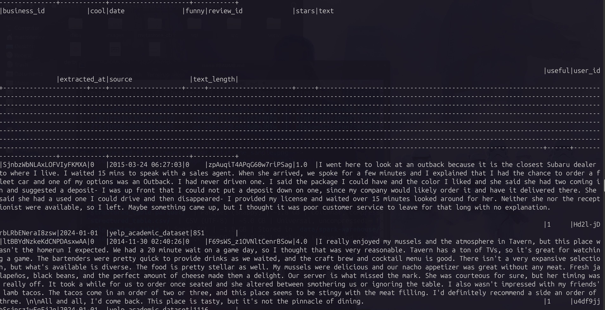
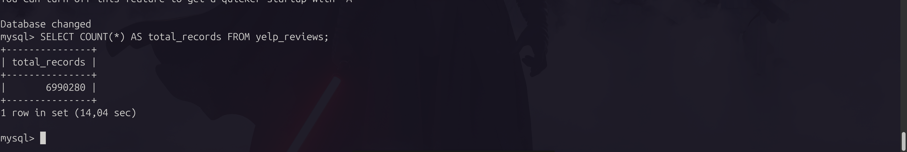
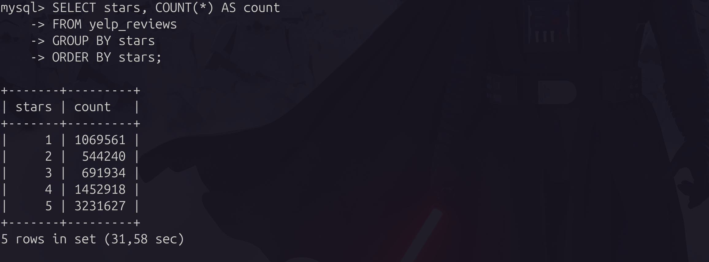

# Unstructured JSON to Table with PySpark

A robust ETL pipeline that converts the Yelp Academic Dataset Review JSON (semi-structured) into a structured table format using Apache PySpark. The pipeline outputs the data in multiple formats — Parquet, CSV, Spark SQL table, and MySQL — for downstream analytics and reporting.




---

## Table of Contents

- [Overview](#overview)
- [Features](#features)
- [Architecture](#architecture)
- [Project Structure](#project-structure)
- [Installation](#installation)
- [Configuration](#configuration)
- [Running the Pipeline](#running-the-pipeline)
- [Results & Output Explanation](#results--output-explanation)
- [Code Explanation](#code-explanation)
- [Troubleshooting](#troubleshooting)
- [License](#license)
- [Author](#author)
- [Acknowledgments](#acknowledgments)

---

## Overview

This project processes the [Yelp Academic Dataset](https://www.yelp.com/dataset), specifically the `yelp_academic_dataset_review.json` file, which contains millions of newline-delimited JSON objects (each line is one review). The goal is to transform this semi-structured data into a clean, structured format suitable for analysis.

The pipeline performs:

1. **Extract** — Read JSON lines into a Spark DataFrame
2. **Transform** — Parse nested JSON, select expected columns, add metadata
3. **Clean** — Filter invalid records, validate star ratings, add `text_length` feature
4. **Load** — Save as Parquet, CSV, Spark SQL table, and MySQL database

---

## Features

- ✅ Processes large JSON files (6+ GB) efficiently with PySpark
- ✅ Automatic MySQL database setup (creates database and table from SQL schema)
- ✅ Multiple output formats: Parquet (columnar), CSV (universal), Spark SQL table (in-memory querying), MySQL (OLTP)
- ✅ Data cleaning and validation (remove nulls, validate star ratings 1–5)
- ✅ Configurable via environment variables (`.env`)
- ✅ Step-by-step logging for monitoring pipeline progress
- ✅ Repartitioning for optimal performance on large datasets
- ✅ Batch writing to MySQL for write efficiency

---

## Architecture



---

## Project Structure

```
.
├── data/
│   ├── yelp_academic_dataset_review.json     # Input JSON file (~5.3 GB)
│   ├── structured_table.csv/                 # Output CSV (Spark part files)
│   ├── structured_table.parquet/             # Output Parquet (Spark part files)
│   └── spark-warehouse/                      # Spark-managed SQL tables (Derby)
├── metastore_db/                             # Spark Hive metastore metadata
├── sql/
│   └── schema_data.sql                       # MySQL DDL schema script
├── src/
│   ├── main.py                               # Main ETL pipeline orchestrator
│   ├── __init__.py
│   ├── utils/
│   │   ├── spark_config.py                   # Spark session factory
│   │   └── mysql_config.py                   # MySQL setup utilities
│   └── etl/
│       ├── __init__.py
│       ├── extract.py                        # Step 2: JSON extraction
│       ├── transform.py                      # Steps 3 & 4: Transform + Clean
│       └── load.py                           # Steps 5–7: Load to destinations
├── .env                                      # Environment variables (not committed)
├── .env.example                              # Template for .env
├── .gitignore
├── requirements.txt                          # Python dependencies
└── README.md
```

---

## Installation

### Prerequisites

| Requirement | Minimum Version | Notes |
|---|---|---|
| Python | 3.8+ | 3.10+ recommended |
| Java (JDK) | 11+ | Required by Spark |
| MySQL Server | 5.7+ | For MySQL output only |
| PySpark | 3.4+ | Installed via `requirements.txt` |

### Step-by-Step Setup

**1. Clone the repository**

```bash
git clone https://github.com/gladytdavianus/unstructured-json-to-table-with-pyspark.git
cd unstructured-json-to-table-with-pyspark
```

**2. Create and activate a virtual environment**

```bash
# macOS / Linux
python -m venv venv
source venv/bin/activate

# Windows
python -m venv venv
venv\Scripts\activate
```

**3. Install Python dependencies**

```bash
pip install -r requirements.txt
```

**4. Install Java 11 (if not already installed)**

```bash
# Ubuntu / Debian
sudo apt-get update && sudo apt-get install -y openjdk-11-jdk

# macOS (Homebrew)
brew install openjdk@11

# Verify
java -version
```

**5. Download the Yelp Dataset**

- Visit [https://www.yelp.com/dataset](https://www.yelp.com/dataset) and register to download
- Extract and place `yelp_academic_dataset_review.json` inside the `data/` directory
- Verify file size: approximately **5.3 GB** (6.99M records as of the 2022 release)

```bash
mkdir -p data
mv ~/Downloads/yelp_academic_dataset_review.json data/
ls -lh data/yelp_academic_dataset_review.json
```

**6. Configure environment variables**

```bash
cp .env.example .env
```

Edit `.env` with your MySQL credentials:

```env
MYSQL_HOST=localhost
MYSQL_PORT=3306
MYSQL_USER=root
MYSQL_PASSWORD=your_password_here
MYSQL_DATABASE=yelp_db
```

---

## Configuration

### Environment Variables

| Variable | Default | Description |
|---|---|---|
| `MYSQL_HOST` | `localhost` | MySQL server hostname or IP |
| `MYSQL_PORT` | `3306` | MySQL port |
| `MYSQL_USER` | `root` | MySQL username |
| `MYSQL_PASSWORD` | *(empty)* | MySQL password |
| `MYSQL_DATABASE` | `yelp_db` | Target database name (auto-created) |

### Spark Configuration (`src/utils/spark_config.py`)

Key settings you may need to tune based on your machine's resources:

| Config Key | Default | When to Change |
|---|---|---|
| `spark.executor.memory` | `8g` | Lower to `4g` if RAM < 16 GB |
| `spark.driver.memory` | `4g` | Lower to `2g` if RAM < 8 GB |
| `spark.sql.shuffle.partitions` | `200` | Raise to `400` on machines with many cores |
| `spark.sql.adaptive.enabled` | `true` | Keep enabled for dynamic optimization |

### Output Paths (`src/main.py`)

| Variable | Default Path | Description |
|---|---|---|
| `json_path` | `data/yelp_academic_dataset_review.json` | Input JSON file |
| `parquet_output` | `data/structured_table.parquet` | Parquet output directory |
| `csv_output` | `data/structured_table.csv` | CSV output directory |
| `spark_table` | `yelp_reviews_table` | Spark SQL managed table name |
| `mysql_table` | `yelp_reviews` | MySQL target table name |

---

## Running the Pipeline

### Basic Run

Make sure your virtual environment is active and MySQL is running, then:

```bash
python src/main.py
```

### Optional: Run with a Sample (for Development / Testing)

To test the pipeline without loading all 6.99M records, temporarily add `.limit(100000)` after the extract step in `src/main.py`:

```python
# In main.py, after the extract step — for testing only
df_raw = df_raw.limit(100_000)
```

Then run normally:

```bash
python src/main.py
```

### Monitor Spark UI (Optional)

While the pipeline is running, open your browser and go to:

```
http://localhost:4040
```





---

## Results & Output Explanation

### Full Console Output

When you run `python src/main.py` against the full dataset, the console output will look like this:

```
======================================================================
  UNSTRUCTURED JSON TO TABLE WITH PYSPARK
  Yelp Academic Dataset Review ETL Pipeline
======================================================================

[STEP 0/8] SETUP MySQL DATABASE
Setting up MySQL database from: sql/schema_data.sql
MySQL database setup completed!

[STEP 1/8] CREATE SPARK SESSION
Spark: 3.4.1

[STEP 2/8] EXTRACT JSON
Loading: data/yelp_academic_dataset_review.json
File size: data/yelp_academic_dataset_review.json
✅ Extracted 6985954 records
⚠️  Large dataset: 6985954 records (>1M)

[STEP 3/8] TRANSFORM
Transforming JSON to structured table...
✅ Transformed: 6985954 → 6985954 records
✅ Columns: ['review_id', 'user_id', 'business_id', 'stars', 'text',
             'date', 'useful', 'funny', 'cool', 'extracted_at', 'source']

[STEP 4/8] CLEAN
Cleaning data...
✅ Cleaned: 6985954 → 6985954 records
   Removed: 0 records (null/invalid)

[STEP 5/8] LOAD TO SPARK TABLE
Saving to Spark table: yelp_reviews_table
Table created/overwritten: yelp_reviews_table

[STEP 6/8] LOAD TO PARQUET
Saving to Parquet: data/structured_table.parquet
Parquet saved: data/structured_table.parquet (6985954 records)

[STEP 7/8] LOAD TO CSV + MySQL
Saving to CSV: data/structured_table.csv
CSV saved: data/structured_table.csv (6985954 records)
Saving to MySQL: yelp_db.yelp_reviews
Data loaded to MySQL (spark-jdbc): yelp_db.yelp_reviews (6985954 records)

======================================================================
  ETL COMPLETED!
======================================================================

Final Output:
   - Input:        data/yelp_academic_dataset_review.json
   - Parquet:      data/structured_table.parquet
   - CSV:          data/structured_table.csv
   - Spark Table:  yelp_reviews_table
   - MySQL:        yelp_db.yelp_reviews
   - Total Records Processed: 6,985,954

Expected: ~6.99 million records (full Yelp dataset)
======================================================================
```

### Step-by-Step Output Explanation

| Step | What It Does | What Success Looks Like |
|---|---|---|
| **STEP 0** — MySQL Setup | Connects to MySQL and runs `schema_data.sql` to create the `yelp_db` database and `yelp_reviews` table | `MySQL database setup completed!` |
| **STEP 1** — Spark Session | Initializes a local Spark session with JDBC driver and adaptive query execution | `Spark: 3.4.x` printed without errors |
| **STEP 2** — Extract | Reads the `.json` file into a DataFrame using `spark.read.json()` | Record count matches expected ~6.99M |
| **STEP 3** — Transform | Selects and casts columns, adds `extracted_at` and `source` metadata columns | Row count stays the same (no rows dropped here) |
| **STEP 4** — Clean | Drops rows with null `review_id` or `text`, validates `stars` is between 1–5, adds `text_length` column | `Removed: 0 records` on a clean dataset |
| **STEP 5** — Load Spark Table | Writes a managed Hive-compatible table to `data/spark-warehouse/` | Table is queryable via `spark.sql("SELECT ...")` |
| **STEP 6** — Load Parquet | Writes columnar Parquet files to `data/structured_table.parquet/` | Directory contains `part-*.parquet` files |
| **STEP 7** — Load CSV + MySQL | Writes CSV with header and also bulk-loads to MySQL via JDBC in batches of 5,000 | Both `CSV saved` and `Data loaded to MySQL` confirmed |

### Output Schema

After a successful run, the structured table has the following columns:

| Column | Type | Description |
|---|---|---|
| `review_id` | string | Unique identifier for each review |
| `user_id` | string | Yelp user who wrote the review |
| `business_id` | string | Yelp business being reviewed |
| `stars` | double | Star rating given (1.0–5.0) |
| `text` | string | Full review text |
| `date` | string | Review submission date (`YYYY-MM-DD`) |
| `useful` | long | Number of "useful" votes received |
| `funny` | long | Number of "funny" votes received |
| `cool` | long | Number of "cool" votes received |
| `text_length` | integer | Character count of `text` (added during Clean step) |
| `extracted_at` | string | Pipeline run date (audit column) |
| `source` | string | Always `yelp_academic_dataset` (audit column) |

### Sample Output Records

The cleaned DataFrame looks like this (first 3 rows):

| review_id | user_id | business_id | stars | text (truncated) | date | useful | funny | cool | text_length |
|---|---|---|---|---|---|---|---|---|---|
| `Q1sbwvVQXV2734tPgoKj4Q` | `hG7b0MtEbXx5QzbzE6C_VA` | `ujmEBvifdJM6h6RLv4wQIg` | 1.0 | Total bill for this horrible service... | 2013-05-07 | 6 | 1 | 0 | 284 |
| `GJXCdrto3ASJOqKeVWPi6Q` | `yXQM5uF2jS6es16SJzNHfg` | `NZnhc2sEQy3RmzKTZnqtwQ` | 5.0 | I *adore* Travis at the Hard Rock... | 2012-12-03 | 0 | 0 | 0 | 602 |
| `2TzJjDVDEuAW6MR5Vybp5i` | `n6-Gk65cPZL6Uz8qRm3NYw` | `WTqjgwHlXbSFuu75X7wKlQ` | 5.0 | I have to say that this office does... | 2016-05-28 | 17 | 0 | 0 | 870 |




### Output File Sizes (Approximate, Full Dataset)

| Output | Format | Size | Notes |
|---|---|---|---|
| `structured_table.parquet/` | Parquet (Snappy) | ~1.8 GB | Columnar, compressed — best for analytics |
| `structured_table.csv/` | CSV (UTF-8) | ~5.0 GB | Universal, uncompressed — for sharing |
| `yelp_reviews_table` | Spark SQL | ~1.8 GB | Stored in `data/spark-warehouse/` |
| `yelp_db.yelp_reviews` | MySQL InnoDB | ~4.5 GB | Includes indexes and row metadata |

### Verifying the Results

**Verify Parquet output (Python):**

```python
from pyspark.sql import SparkSession

spark = SparkSession.builder.master("local[*]").getOrCreate()
df = spark.read.parquet("data/structured_table.parquet")
df.printSchema()
df.show(5, truncate=80)
print(f"Total records: {df.count():,}")
```

**Verify MySQL output:**

```sql
-- Connect to MySQL and run:
USE yelp_db;

SELECT COUNT(*) AS total_records FROM yelp_reviews;
-- Expected: 6,985,954

SELECT stars, COUNT(*) AS count
FROM yelp_reviews
GROUP BY stars
ORDER BY stars;
```






**Verify CSV output:**

```bash
# Count rows (subtract 1 for header)
wc -l data/structured_table.csv/part-*.csv

# Preview first 5 lines
head -5 data/structured_table.csv/part-00000-*.csv
```

---

## Code Explanation

### Main Pipeline (`src/main.py`)

The orchestrator that runs all 8 steps sequentially:

1. **MySQL Setup** — Creates database and table using `sql/schema_data.sql`
2. **Spark Session** — Configures PySpark with MySQL JDBC driver and memory settings
3. **Extract** — Reads newline-delimited JSON into a DataFrame
4. **Transform** — Parses structure (flat or nested), ensures required columns exist, adds audit metadata
5. **Clean** — Removes records with null `review_id` or `text`, validates star ratings (1–5), adds `text_length`
6. **Load** — Writes to four destinations: Spark SQL table, Parquet, CSV, MySQL

### Key Components

#### Spark Configuration (`src/utils/spark_config.py`)

```python
def get_spark_session(app_name="UnstructuredJSONToTable"):
    spark = SparkSession.builder \
        .appName(app_name) \
        .master("local[*]") \
        .config("spark.jars.packages", "com.mysql:mysql-connector-j:8.0.33") \
        .config("spark.sql.adaptive.enabled", "true") \
        .config("spark.executor.memory", "8g") \
        .config("spark.driver.memory", "4g") \
        .config("spark.sql.warehouse.dir", "data/spark-warehouse") \
        .enableHiveSupport() \
        .getOrCreate()
    spark.sparkContext.setLogLevel("WARN")
    return spark
```

**Key optimizations:**
- `local[*]` — uses all available CPU cores
- Adaptive Query Execution (AQE) — dynamically optimizes partitioning at runtime
- MySQL JDBC driver fetched automatically via Maven coordinates
- Memory tuned for large dataset processing
- Log level set to `WARN` to reduce console noise

#### Extract (`src/etl/extract.py`)

```python
def extract_json(spark: SparkSession, file_path: str) -> DataFrame:
    df = spark.read.json(file_path, multiLine=False)
    record_count = df.count()
    print(f"✅ Extracted {record_count} records")
    return df
```

**Notes:**
- Uses Spark's native JSON reader (lazy evaluation — fast schema inference on large files)
- `multiLine=False` because each review is a single JSON line (NDJSON format)
- Spark infers schema automatically from the first pass

#### Transform (`src/etl/transform.py`)

```python
def transform_json_to_table(df: DataFrame) -> DataFrame:
    # Handle nested JSON if needed
    if "review_id" not in df.columns:
        schema = StructType([...])
        df = df.withColumn("review", from_json(col("json"), schema))
        df = df.select("review.*")

    # Ensure all expected columns exist (defensive programming)
    expected_columns = ["review_id", "user_id", "business_id", "stars",
                        "text", "date", "useful", "funny", "cool"]
    for col_name in expected_columns:
        if col_name not in df.columns:
            df = df.withColumn(col_name, lit(None))

    # Add audit metadata
    df = df.withColumn("extracted_at", lit("2024-01-01"))
    df = df.withColumn("source", lit("yelp_academic_dataset"))
    return df
```

**Why this approach:**
- Handles both pre-flattened NDJSON and doubly-nested JSON structures
- Defensive column checking ensures no `KeyError` on schema variations between dataset versions
- Audit columns (`extracted_at`, `source`) support data lineage tracking

#### Clean (`src/etl/transform.py`)

```python
def clean_data(df: DataFrame) -> DataFrame:
    df = df.filter(col("review_id").isNotNull())
    df = df.filter(col("text").isNotNull())
    df = df.filter(col("text") != "")
    df = df.withColumn("text_length", length(col("text")))
    df = df.filter(col("stars") >= 1)
    df = df.filter(col("stars") <= 5)
    return df
```

**Data quality checks:**
- Eliminates records missing essential identifiers (`review_id`)
- Ensures text content exists and is non-empty
- Adds `text_length` as a feature useful for NLP / sentiment analysis downstream
- Enforces business rule: star ratings must be in range [1, 5]

#### Load (`src/etl/load.py`)

Four loading functions covering different output paradigms:

1. **Spark SQL Table** — queryable in-session via `spark.sql()`
   ```python
   df.write.mode("overwrite").saveAsTable(table_name)
   ```

2. **Parquet** — columnar, compressed, ideal for analytics engines (Hive, Athena, BigQuery)
   ```python
   df.write.mode("overwrite").parquet(output_path)
   ```

3. **CSV** — universal format with header row, readable by any tool
   ```python
   df.write.mode("overwrite").option("header", "true").csv(output_path)
   ```

4. **MySQL via JDBC Batch** — efficient batch inserts (5,000 records per transaction)
   ```python
   df.write \
     .mode("overwrite") \
     .format("jdbc") \
     .option("url", jdbc_url) \
     .option("dbtable", table) \
     .option("batchsize", "5000") \
     .save()
   ```

---

## Troubleshooting

### Common Issues and Solutions

#### 1. Java Not Found

**Error:** `JAVA_HOME is not set` or `java: command not found`

**Solution:**
```bash
# Ubuntu / Debian
sudo apt-get install openjdk-11-jdk
export JAVA_HOME=/usr/lib/jvm/java-11-openjdk-amd64
export PATH=$PATH:$JAVA_HOME/bin

# Add to ~/.bashrc or ~/.zshrc for persistence
echo 'export JAVA_HOME=/usr/lib/jvm/java-11-openjdk-amd64' >> ~/.bashrc
```

---

#### 2. MySQL Connection Failed

**Error:** `Communications link failure` or `Access denied for user`

**Solutions:**
- Verify MySQL is running: `sudo systemctl status mysql`
- Check credentials in `.env`
- Grant privileges to your user:
  ```sql
  GRANT ALL PRIVILEGES ON yelp_db.* TO 'your_user'@'localhost';
  FLUSH PRIVILEGES;
  ```
- Test connection manually:
  ```bash
  mysql -u root -p -h localhost
  ```

---

#### 3. Out of Memory Errors

**Error:** `ExecutorLostFailure` or `GC overhead limit exceeded`

**Solutions:**
- Reduce memory in `spark_config.py`:
  ```python
  .config("spark.executor.memory", "4g")
  .config("spark.driver.memory", "2g")
  ```
- Increase shuffle partitions if you have many cores:
  ```python
  .config("spark.sql.shuffle.partitions", "400")
  ```
- Add swap space:
  ```bash
  sudo fallocate -l 4G /swapfile
  sudo chmod 600 /swapfile
  sudo mkswap /swapfile
  sudo swapon /swapfile
  ```

---

#### 4. MySQL JDBC Driver Not Found

**Error:** `ClassNotFoundException: com.mysql.cj.jdbc.Driver`

**Solution:** The driver is fetched automatically via `spark.jars.packages`. If that fails (e.g., no internet access), download manually:
- Download [MySQL Connector/J 8.0.33](https://dev.mysql.com/downloads/connector/j/)
- Copy the JAR to `$SPARK_HOME/jars/`, or run with:
  ```bash
  python src/main.py --jars /path/to/mysql-connector-j-8.0.33.jar
  ```

---

#### 5. Permission Denied on Data Directory

**Error:** `org.apache.hadoop.security.AccessControlException: Permission denied`

**Solution:**
```bash
chmod -R 755 data/
chown -R $USER:$USER data/
chmod -R 755 data/spark-warehouse/
```

---

#### 6. Schema Mismatch / Column Not Found

**Error:** `Cannot resolve column name` or `Unexpected character` during JSON parsing

**Solutions:**
- Verify the JSON structure of your Yelp dataset version
- Inspect a sample:
  ```python
  from src.etl.extract import extract_json_sample
  import json

  samples = extract_json_sample("data/yelp_academic_dataset_review.json", 3)
  print(json.dumps(samples, indent=2))
  ```
- Update the expected columns list in `transform_json_to_table()` to match

---

#### 7. Long Running Times

**Observation:** Processing 6M records takes > 1 hour

**Optimizations:**
- Use SSD storage for the `data/` directory
- Increase executor memory if your RAM allows (e.g., `12g` on 32 GB machines)
- For development, limit records in `main.py`:
  ```python
  df_raw = df_raw.limit(100_000)
  ```
- Monitor bottlenecks in Spark UI at `http://localhost:4040`

---

### Getting Help

If you encounter an issue not listed above:

1. Check the step-by-step console logs — each step prints its result
2. Open Spark UI at `http://localhost:4040` to inspect failed stages
3. Search [PySpark mailing lists](https://lists.apache.org/list.html?devspark@spark.apache.org)
4. Open a GitHub Issue with:
   - Full error traceback
   - System specs (OS, Java version, Python version, RAM)
   - Your `.env` file contents (replace password with `***`)
   - The exact command you ran

---

## License

This project is licensed under the MIT License — see the [LICENSE](LICENSE) file for details.

---

## Author

> Built and maintained by **Glady T. Davianus**

🔗 GitHub: [https://github.com/gladytdavianus/unstructured-json-to-table-with-pyspark](https://github.com/gladytdavianus/unstructured-json-to-table-with-pyspark)

> Contributions and pull requests are welcome.

---

## Acknowledgments

- [Yelp](https://www.yelp.com/dataset) — for providing the open academic dataset
- [Apache Spark](https://spark.apache.org/) — for the distributed computing engine
- [MySQL](https://www.mysql.com/) — for the relational database
- Open-source contributors of `python-dotenv`, `pymysql`, and the PySpark community

---

*Last updated: June 2026*
